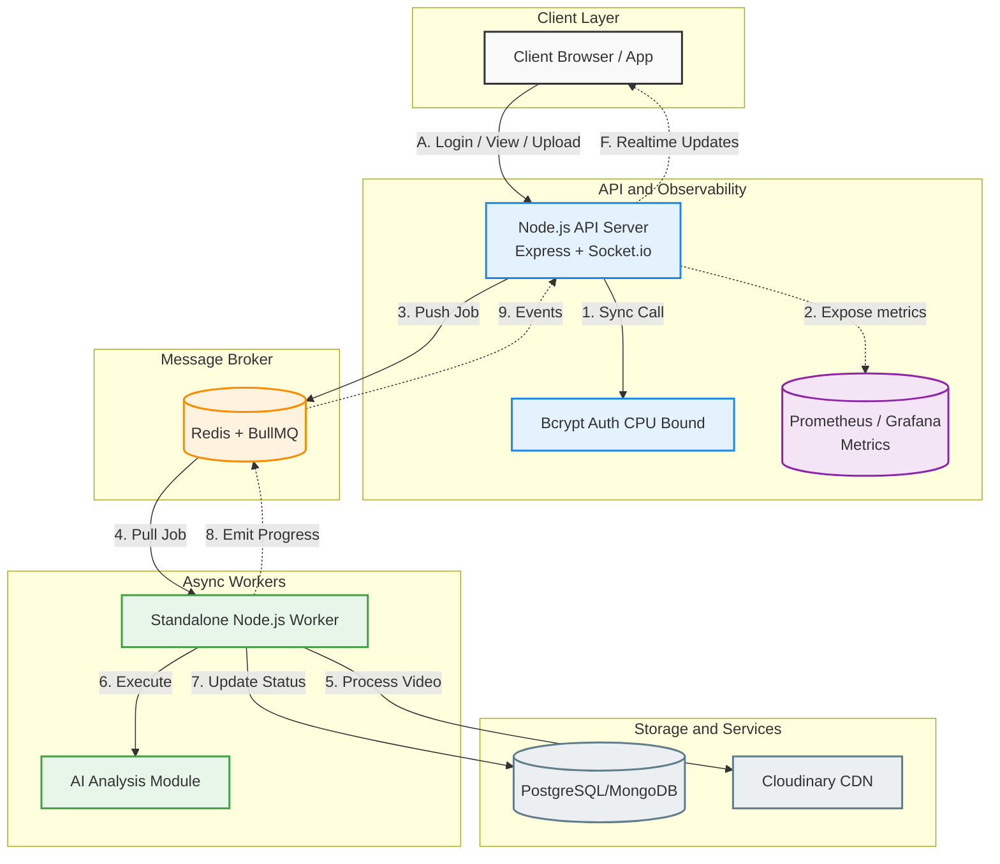

# 🎬 V-Stream: Cloud-Native Multi-Tenant Media Engine

V-Stream is a distributed video ingestion and streaming pipeline built to handle high-concurrency workloads. Engineered with a focus on protecting the Node.js event loop, this project demonstrates real-world architectural patterns including asynchronous task decoupling, multi-tenant data isolation, and comprehensive system observability.

---

## 🏗️ System Architecture



---

## 🚀 Engineering Impact & Bottlenecks Solved

### Decoupled Heavy Workloads
Profiled using autocannon; CPU-heavy tasks pushed latency to **8.4s**. Solved via **BullMQ + Redis background jobs**.

### Preserved API Responsiveness
Separated API and Worker → maintained **~25ms response time under load**.

### Data-Driven Observability
- Prometheus metrics
- Grafana dashboards
- Pino structured logs
- Tenant-aware tracing

### Strict Multi-Tenancy
Secure isolation ensuring **Organization-level data separation**.

---

## 💻 Tech Stack

- **Backend:** Node.js, Express, Socket.io  
- **Queue:** Redis, BullMQ  
- **Observability:** Prometheus, Grafana, Pino  
- **Database:** MongoDB / PostgreSQL  
- **Storage/CDN:** Cloudinary  
- **Frontend:** React, Vite, Tailwind CSS  

---

## ⚙️ Local Development Setup

### 1. Environment Variables

```
PORT=8000
NODE_ENV=development

MONGO_URI=your_db_uri
REDIS_URI=redis://localhost:6379

CLOUDINARY_CLOUD_NAME=your_name  
CLOUDINARY_API_KEY=your_key  
CLOUDINARY_API_SECRET=your_secret  

JWT_SECRET=your_super_secret_key
```

---

### 2. Run Services

```
npm install

# API
npm run dev:api

# Worker
npm run dev:worker

# Frontend
cd frontend && npm run dev
```

---

### 3. Load Testing

```
npm run test:load
```

Monitor `/metrics` endpoint.

---

## 🛣️ Roadmap (Phase 3)

- Circuit Breakers (opossum)
- Idempotency Keys
- Distributed Rate Limiting

---

## 👨‍💻 Author

**Saurabh Kumar Jha**
