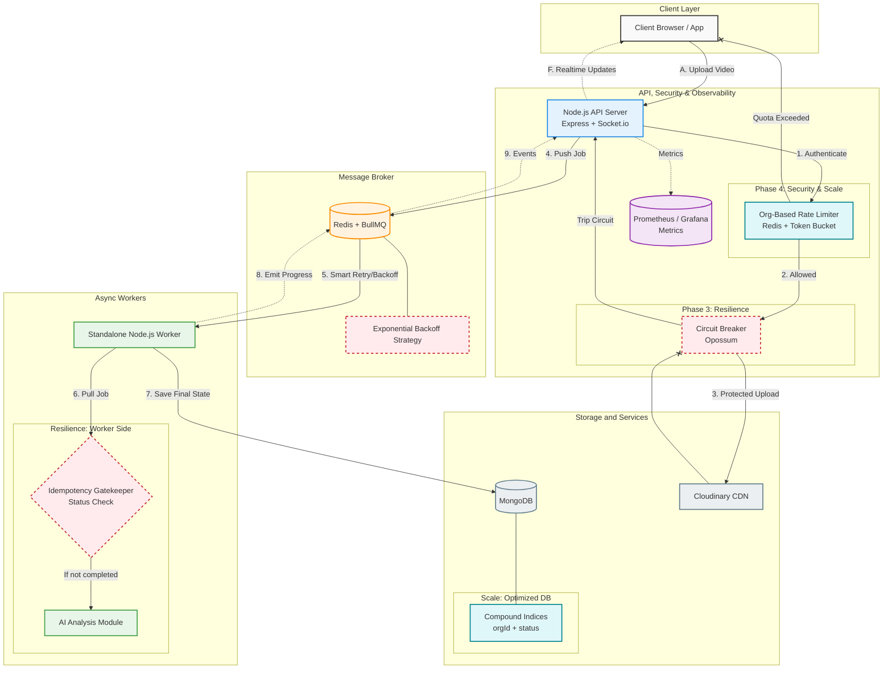

# 🎬 V-Stream: Cloud-Native Multi-Tenant Media Engine

**A production-grade video ingestion pipeline engineered across 4 iterative phases — scaling from a fragile monolith to a resilient, observable, and multi-tenant distributed system.**

Built to solve real engineering bottlenecks: event loop saturation, cascading network failures, thundering herds, and noisy neighbor resource drain.

**Tech Stack:** Node.js, Express, BullMQ, Redis, PostgreSQL/MongoDB, Cloudinary, Prometheus, Grafana.

---

## 🚀 The Engineering Journey (TL;DR)

This system was deliberately evolved through 4 engineering phases. Every architectural decision was driven by load-test metrics, ensuring maximum resource efficiency and a 99.9% fail-fast uptime for the end user.

| Phase | Bottleneck Solved | Engineering Implementation |
| :--- | :--- | :--- |
| **1. Observability** | Flying blind in production | Pino structured logging, Prometheus metrics, Autocannon load profiling |
| **2. Async Architecture** | Event loop blocked at 100 concurrents | BullMQ job queue, decoupled Node.js worker processes |
| **3. Resilience** | Cascading failures from CDN/DB | Opossum circuit breakers, exponential backoff, idempotency checks |
| **4. Scale & Security** | Noisy neighbor / Unbounded usage | Redis-backed token bucket rate limiting (Org-level isolation) |

---

## System Architecture



---

## Phase 1 — Observability: Measure Before You Optimize

**Problem:** No visibility into what the system was actually doing under load.

**What I built:**
- Replaced `console.log` with **Pino** structured JSON logging — machine-readable, searchable, filterable
- Injected `organizationId` from JWT into every log entry via middleware — enabling tenant-level tracing
- Exposed a `/metrics` endpoint using `prom-client` tracking the **Four Golden Signals** (Latency, Traffic, Errors, Saturation)

**Load Test Results (Autocannon):**

| Endpoint | Load | Latency |
|---|---|---|
| Health check | Baseline | ~25ms |
| Login | Light | ~650ms (Bcrypt CPU cost) |
| Login | 100 concurrent users | **8.4s** — system saturated |

**Finding:** Bcrypt's CPU intensity was monopolizing the Node.js event loop, causing a queue that forced all other users to wait. This became the architectural constraint for Phase 2.

---

## Phase 2 — Async Architecture: Protecting the Event Loop

**Problem:** CPU-bound tasks (video analysis, Bcrypt auth) running on the main thread caused 8.4s latencies under load.

**What I built:**
- **Decoupled heavy workloads** — offloaded video analysis to a **BullMQ** background job queue backed by Redis
- **Standalone Worker Processes** — workers run in separate Node.js processes; API server and processing engine scale independently
- **Protected critical paths** — synchronous operations (auth, reads) never compete with async heavy tasks for event loop time

**Result:** API response time maintained at ~25ms under the same load that previously caused 8.4s latency.

**Architecture Decision:** Separate processes (not just worker threads) mean you can horizontally scale workers independently of the API layer based on queue depth — a production-grade pattern used at scale.

---

## Phase 3 — Resilience: Designing for Failure

**Problem:** External service failures (Cloudinary slowdowns, DB restarts) caused cascading failures, memory exhaustion, and duplicate processing on retries.

**Design shift:** Moved from *"things will work"* to *"everything will eventually fail — design for it."*

**What I built:**

**Circuit Breaker (Opossum)**
- Timeout: 60s | Failure threshold: 50% | Reset timeout: 30s
- When Cloudinary or DB is degraded, the breaker trips — API returns a fast error instead of waiting 30s per request, preserving CPU and memory

**Idempotency Guard**
- BullMQ retries failed jobs automatically — but a job that fails *after* uploading to Cloudinary but *before* saving to DB would create duplicate files
- Solution: workers check `video.status === "completed"` before processing — making every job safe to retry N times

**Exponential Backoff with Jitter**
- Prevents the **Thundering Herd**: if DB restarts and 1,000 workers reconnect simultaneously, they crash it again
- Workers wait 5s → 10s → 20s (with jitter) before retrying — gradual, staggered recovery

**Before vs After:**

| Scenario | Before | After |
|---|---|---|
| Cloudinary slow | Server hangs, timeouts cascade | Circuit trips, fast failure returned |
| High concurrent load | Memory overflow | Controlled via memory-buffered Multer |
| DB restart | All workers hammer DB simultaneously | Staggered reconnection via backoff |
| Job retry | Duplicate Cloudinary uploads | Idempotency guard skips completed jobs |

---

## Phase 4 — Multi-Tenancy & Rate Limiting: Fairness at Scale

**Problem:** In a multi-tenant SaaS system, one organization running a buggy script or a malicious bulk-upload attack could exhaust the Redis queue, overwhelm workers, and starve every other tenant.

**What I built:**

**Organization-Level Rate Limiting (Token Bucket via `rate-limiter-flexible` + Redis)**

- **Atomic counting in Redis** — works across all API server instances; no race conditions
- **Limits by `organizationId` from JWT** — not by IP (easily spoofed); enforces quotas at the company level across all employees
- **Pre-emptive rejection before Multer** — requests are rejected *before* the server starts receiving video bytes, protecting bandwidth and memory
- **Proper HTTP 429 responses** with `Retry-After` header — client knows exactly when to retry

**Result:**

| Scenario | Before | After |
|---|---|---|
| Bulk upload attack | 500 jobs flood the queue | Rejected after quota exceeded |
| Resource usage | Unpredictable, potentially unbounded | Strictly capped per org |
| Fairness | First-come-first-served (starves other tenants) | Guaranteed bandwidth per org |
| Client experience | Requests silently time out | HTTP 429 with `Retry-After` |

---

## Key Engineering Decisions & Why

| Decision | Rationale |
|---|---|
| Separate worker process, not worker threads | Independent scaling; fault isolation; cleaner process boundaries |
| Redis for rate limit state, not in-memory | Shared state across horizontally scaled API instances |
| Limit by `organizationId`, not IP | IP is spoofable; org ID from JWT is authoritative in multi-tenant context |
| Pre-Multer rate limit middleware | Reject before receiving bytes — saves bandwidth, CPU, and memory |
| Idempotency via status check, not a separate key store | Leverages existing DB record; no extra infrastructure |
| Exponential backoff with jitter | Prevents thundering herd without tight retry coordination |

---

## Tech Stack

| Layer | Technology |
|---|---|
| **API Server** | Node.js, Express, Socket.io |
| **Job Queue** | BullMQ, Redis |
| **Resilience** | Opossum (circuit breaker), rate-limiter-flexible |
| **Observability** | Prometheus, Grafana, Pino |
| **Database** | MongoDB / PostgreSQL |
| **Storage / CDN** | Cloudinary |
| **Frontend** | React, Vite, Tailwind CSS |
| **Load Testing** | Autocannon |

---

## Local Development

### Environment Variables

```env
PORT=8000
NODE_ENV=development        # or production

# Database
MONGO_URI=mongodb://127.0.0.1:27017/videoStreamApp

CLOUDINARY_CLOUD_NAME=your_name
CLOUDINARY_API_KEY=your_key
CLOUDINARY_API_SECRET=your_secret
# Auth
JWT_SECRET=your_super_secure_jwt_secret
JWT_EXPIRE=24h
BCRYPT_SALT_ROUNDS=10

# URLs
CLIENT_URL=http://localhost:5173
SERVER_URL=http://localhost:8000

# Cloudinary
CLOUDINARY_CLOUD_NAME=
CLOUDINARY_API_KEY=
CLOUDINARY_API_SECRET=

# Logging
LOG_LEVEL=info

# Redis (local)
REDIS_HOST=127.0.0.1
REDIS_PORT=6379

# Redis (production — uncomment and set for Upstash)
# NODE_ENV=production
# REDIS_URL=your_upstash_redis_url
```

### Run Services

```bash
npm install
# or if you hit peer dependency conflicts:
npm install --legacy-peer-deps

npm run start:all        # starts API server + worker process together
```

**Frontend:**
```bash
cd frontend
npm install
npm run dev
```

```bash
npm run test:load
# Monitor real-time metrics at /metrics
# View dashboards in Grafana
```

---

## What This Project Demonstrates

- **Systems thinking** — each phase was driven by measurement, not assumption
- **Production-grade patterns** — circuit breakers, idempotency, backoff, distributed rate limiting used at FAANG scale
- **Multi-tenancy** — real isolation, not just namespacing
- **Observability-first** — you can't improve what you don't measure
- **Incremental architecture** — building complexity only when the data demands it

---

## Author

**Saurabh Kumar Jha** — Backend Engineer focused on distributed systems, high-throughput pipelines, and production-resilient architecture.

[LinkedIn](https://www.linkedin.com/in/saurabhkumar171/) · [GitHub](https://github.com/SaurabhKumar171)
